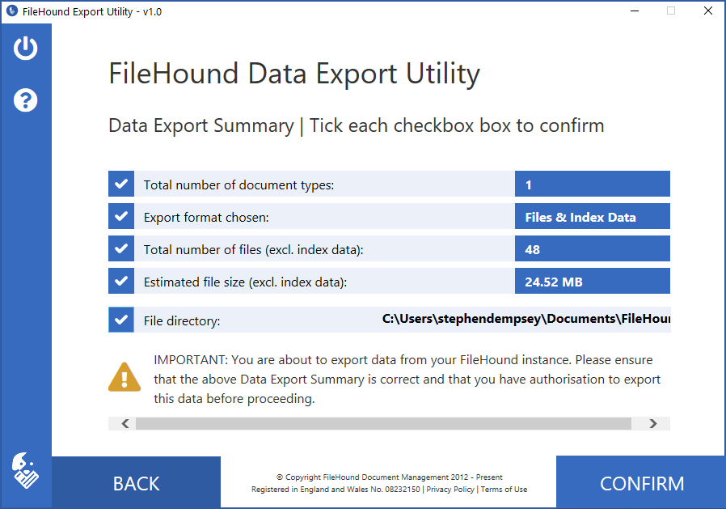
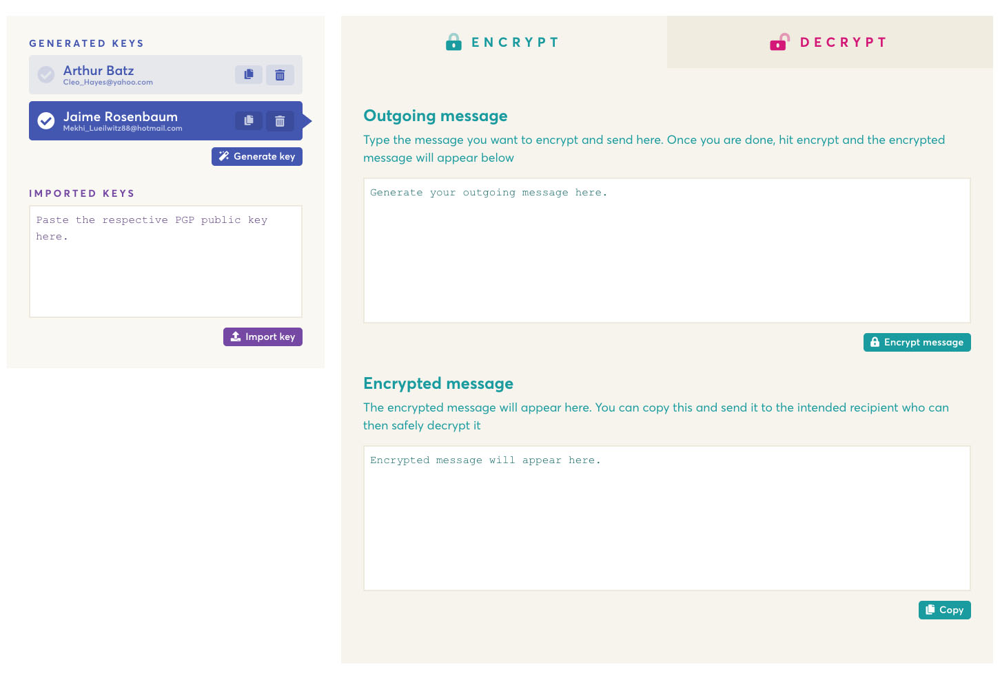

+++
title = "Showcase"
date = 2019-08-29T04:56:50+10:00
weight = 20
chapter = true
+++

# Showcase

In this section we highlight the projects using Wails.

   
   
   
   
   
   
   
   
   
   
   
   
   
   

