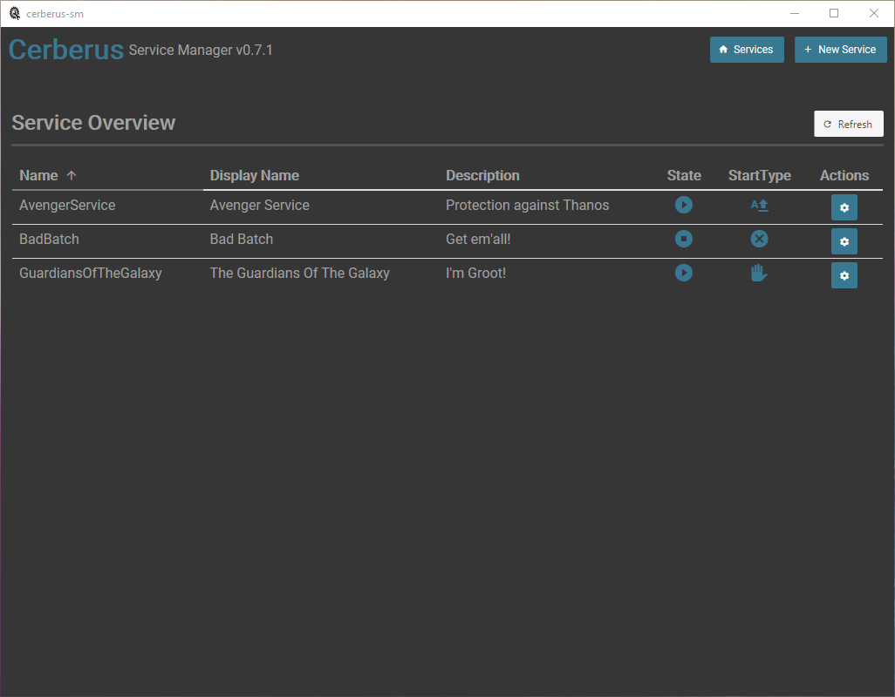

+++
title = "Cerberus Service Manager"
date = 2021-04-16T21:49:50+01:00
weight = 99
+++

    

[Cerberus Service Manager](https://github.com/go-sharp/cerberus-sm/) A simple GUI for the cerberus library. 

Cerberus Service Manager is a Windows service helper program inspired by NSSM. It can be used to create and manage Windows services for ordinary binaries. If a CLI Tool is preferred, one can use the cerberus base program https://github.com/go-sharp/cerberus (Cerberus Service Manager is based on cerberus).