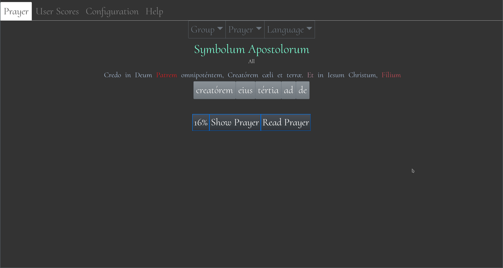

+++
title = "LaCap"
date = 2020-11-16
weight = 99
+++

[LaCap](https://gitlab.com/latin-catholic-prayers/) This is a program that is still in alpha stage
that is used to memorize prayers in Latin 

In order to install this on manjaro, arch, antergos or other arch based Linux distro type yay -S
lacap.    This program allows you to memorize Latin prayers (or their English equivalents) by
presenting a 5 option multiple choice for each of the words.   The output is the prayer itself and
the more "red" the answer is in the output the more times you got it wrong before getting it
right.  The program "buzzes" when you pick the wrong answer and pronounces the word on selecting
the correct one.   Pressing the button that has a score on it in percent saves the value under
your current user and you can look at your trends over time.   
